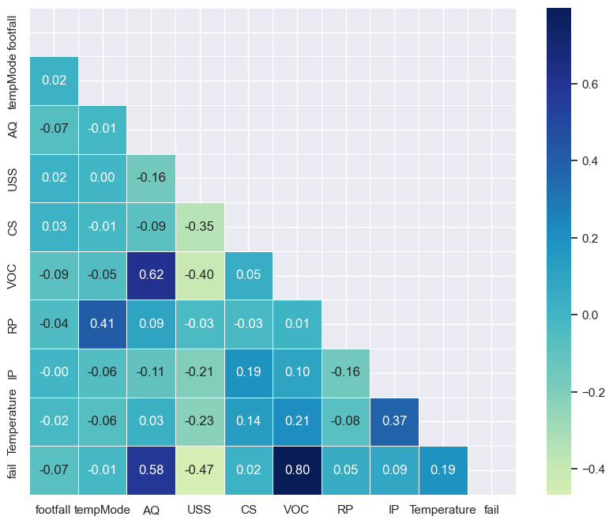
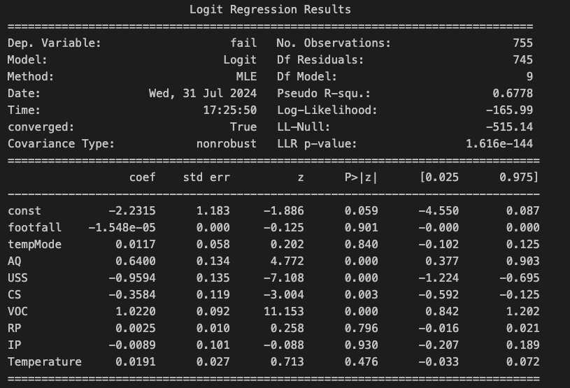
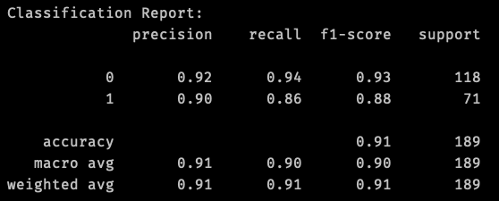

## Project Overview
This project explores one of [Kaggle’s public datasets](https://www.kaggle.com/datasets/umerrtx/machine-failure-prediction-using-sensor-data) that contains sensor data collected from various machines as well as if those machines failed or not. I wanted to explore each of the features to see if I would be able to identify any significant correlations, patterns as well as use those features to predict machine failure. 

## Installation and Setup

Fork and Clone the [repository](https://github.com/jhardin7612/machine_failure_prediction) to your local machine. 

_Please note this project was coded and tested using python version 3.11.7._

**Required Libraries:**
1. Pandas
2. Numpy
3. Streamlit
4. Pickle
5. matplotlib.pyplot
6. Seaborn
7. sklearn.model_selection
8. sklearn.linear_model
9. sklearn.metrics
10. sklearn.preprocessing 
11.argparse

To run the streamlit application from your local machine, you will need to run the following command from root directory :
```python
streamlit run app.py
```
The application is also accessible via this [link]

To run the model on the training data and receive classification report, you will need to run this command from root directory:
```python
python src/model.py
```
To run the model on the full dataset, run this command from the root directory
```python
python src/model.py --train_full_data
```

## Dataset Overview
According to Kaggle, this dataset contains sensor data collected from various machines. The site does not specify what type of machines or where the data actually originates from. The dataset contains 944 rows and 10 columns. For this specific project the fail column is the target, leaving nine features to explore. The dataset did not require any preprocessing steps as it was already very clean and did not contain any missing values or outliers. 

### Column Description
- footfall: The number of people or objects passing by the machine.
- tempMode: The temperature mode or setting of the machine.
- AQ: Air quality index near the machine.
- USS: Ultrasonic sensor data, indicating proximity measurements.
- CS: Current sensor readings, indicating the electrical current usage of the machine.
- VOC: Volatile organic compounds level detected near the machine.
- RP: Rotational position or RPM (revolutions per minute) of the machine parts.
- IP: Input pressure to the machine.
- Temperature: The operating temperature of the machine.
- fail: Binary indicator of machine failure (1 for failure, 0 for no failure).

## EDA
During my initial exploration, I created a couple quick graphs to help visualize  distribution and correlation. The first graph I made was a simple pair plot that I ended up downsizing to the features with the highest correlation values.  The pair plot allows us to easily the distributions and where the failures tend to lie as the values for the features change. There seems to be a distinct line  at 3 that divides the volatile organic compound(VOC) levels in relation to failure. Without further analysis it would be easy to suggest to keep the VOC levels below 3. Later we will explore the significance of this feature in predicting failure. 

The correlation heat map confirmed my suspicions about VOC levels being positively correlated with failure. It was also interesting to see that air quality and VOC were correlated as well. 



## Hypothesis Testing

After reviewing the graphs, I decided to head directly into my hypothesis testing. 

Null Hypothesis: VOC is not a significant feature for predicting failure

Alternative: There is a significant difference in prediction when using VOC feature.

**Results:** VOC has a p-value of 0.00 and a standard error of 0.092. According the summary results this is not only a significant feature it is the most significant. Three other features were also identified as significant. These four features will be used to build the prediction model. 



## Predicting Machine Failure
For failure prediction, I used a simple logistic regression model and standard scaler to fit and transform the data.  The model was trained on 80% of the dataset. The model currently sits at a 91% accuracy rate. The model only takes in the four significant features identified from my hypothesis testing. The model performs 1% less when it tries to account for all 9 of the features. There is a screenshot of the model’s classification report to view the other metrics provided below. Down the line, I would like to gain access to a larger dataset to see if that would improve evaluation metrics. I would also like to compare other models to this one.


